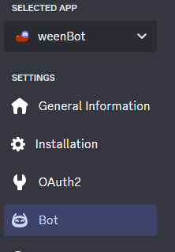
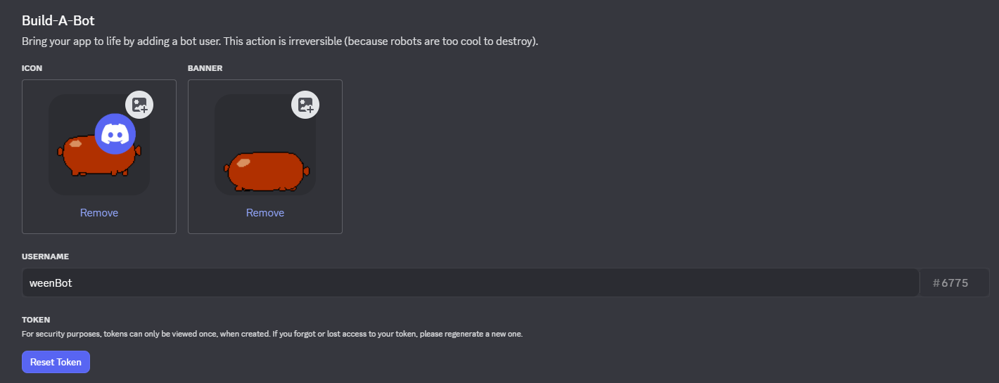
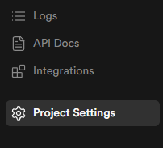
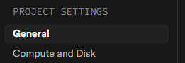
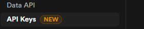
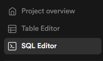
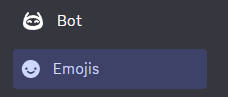

# weenBot

a fun bot for your discord server

# basic overview
this bot was inspired by Cat Bot and other bots!

basically theres fun commands like /bubblewrap or /button!

theres also some moderation commands (only works if the person running it has administrator privleages) like /regexfilter which is like discord's automod but it supports look-behind's and works on admins (which includes yourself too) if you want that.

the bot by default also only can send messages and create commands in servers, so if you wanna use moderation stuff you have to give it something like manage messages for /regexfilter

theres also achievements so thats cool
# setting up the bot
first, you need to go to https://discord.com/developers/applications/.

once there, create a new Application. you can give it a profile picture and name if you want.

then you need to head over to the Bot tab

you should see this page

once here, you need to reset your token and copy it to your clipboard.

when you have done the token step, clone the bot repo using ``git`` and then cd into it. there should be a .env.example file. start editing it!

in there, you need to paste in said token in the ``TOKEN`` variable

also, you need to head to OAuth2 and copy and paste the client id into the ``CLIENT_ID`` variable.

before you leave this step, you need to create/use a server for your bot so you can run stuff like ``/restart`` in it. edit the ``DEV_GUILD_ID`` env variable to be the id of your server, and the ``OWNER_USER_ID`` variable to be your discord user id

## setting up the bot's database
head over to https://supabase.com and register for an account (if you dont have one). then, make a new database and title it however you want!

there, you need to head over to project settings..

...and then to General

here you will find your project id. copy it and put it in the .env.example in the ``SUPABASE_URL`` variable.

the url should be formatted like this:
``https://your_project_id.supabase.co``

once you are done with that, head over to API Keys

in here you need to copy public anon key and paste it in the ``SUPABASE_ANON_KEY`` env variable

the final step of the database! head over to ``src/modules/db.js``. at the very top of the file, there should be a bunch of DB queries. you need to select all of them and paste it into the SQL Editor

once you've pasted them just run them and the bots tables should be setup!

since you (probably) did all of this, your .env.example should be ready to go! however rename it to .env before you start the bot.

## (OPTIONAL) making emojis work
this step can be skipped if you dont want the bot's emojis working (although it is recommended..)

head over to the emojis tab on your bot

here, you need to upload every emoji from src/images/emojis onto this page. dont rename them! then head over to ``src/modules/globals.js``, scroll down to the ``emojiTable`` variable and paste the emoji id for every emoji you uploaded.

yeah there isnt a better way to do this (as of me knowing)

## (OPTIONAL) setting up /gemini and weenspeak
this step can be skipped if you dont want the /gemini command and weenspeak working.

if you do, all you need to do is head over to Google AI Studio, create a new project, make a new api key, and paste it into your .env. if you want, you can even set a custom weenspeak prompt if you want.
